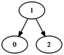

# Algorithm cheat 

Algorithm tutorials and simple implementations with unit tests.

1.  Implementations
    1. [Getting started](getting-started.md)
    1. [src/](src/)
    1. [data/](data/)
    1. [test](test)
1.  [Introduction](introduction.md)
    1.  [Beauty](beauty.md)
        1. [Recursive algorithms](Recursive algorithms.md)
    1.  [Turing machine](turing-machine.md)
        1. [Busy beaver](busy-beaver.md)
    1.  [Out of core algorithms](out-of-core.md)
    1.  [Undecidability](undecidability.md)
    1.  [P vs NP](p-vs-np.md)
1.  Data structures
    1.  [Graph](graph.md)
        1. [Tree](tree.md)
        1. [Dijkstra](dijkstra.md)
    1.  [Map](map.md): [map.cpp](src/cpp/map.cpp),
        1. [BST](bst.md): [bst.cpp](src/cpp/bst.hpp), [bst.c](src/c/bst.c)
        1. [Hash map](hash-map.md): [hash_map.cpp](src/cpp/hash_map.hpp)
        1. [Heap](heap.md): [Heap.java](src/java/Heap.java)
1.  [Sorting algorithms](sort/)
    1. [Quicksort](quicksort.md): [QuickSort.java](src/java/QuickSort.java), [QuickSortTail.java](src/java/QuickSortTail.java)
    1. [Merge sort](merge-sort.md)
    1. [Bubble sort](bubble-sort.md)
1.  Parsing, formal languages and their automatons
    1. [Formal language](formal-language.md)
    1. [Context-free grammar](context-free-grammar.md)
    1. [Regular grammar](regular-grammar.md)
    1. [Regular language](regular-language.md)
1.  [Programming languages](programming-languages.md)
    1. [Type systems](type-systems.md)
1.  String algorithms
    1. [Longest common subsequence](longest-common-subsequence.md)
    1. [Longest increasing subsequence](longest-increasing-subsequence.md)
    1. [Maximum subarray](maximum-subarray.md)
    1. [String search](string-search.md): [StringSearchNaive.java](src/java/StringSearchNaive.java), [KnuthMorrisPratt.java](src/java/KnuthMorrisPratt.java)
    1. Version string parsing: [version_string.c](src/c/version_string.c)
1.  [Cryptography](cryptography.md)
    1. [base64](base64.md)
    1. [ECDSA](ecdsa.md)
    1. [GPG](gpg.md)
    1. [md5sum](md5sum.md)
1.  Linear programming
    1. [Change making](change-making.md)
1.  Out-of-core
    1. [tac](tac.md): [tac.c](src/c/tac.c), [Tac.java](src/java/Tac.java)
1.  Misc algorithms
    1. [Hanoi tower](hanoi-tower.md)
    1. [Hash function](hash-function.md)
    1. [XOR-swap](xor-swap.md)
1.  Numerical
    1. [Matrix multiplication](matrix-multiplication.md)
    1. [PDE](pde.md)
1.  Misc
    1. [Bitcoin](bitcoin.md)
    1. [Decimal data type](decimal-data-type.md)
    1. [Human factors](human-factors.md)
    1. [Licenses](licenses.md)
    1. [Quantum computing](quantum-computing.md)
    1. [Security](security.md)
1.  [Bibliography](bibliography.md)
1.  [TODO](TODO.md)

## WIP

1.  [Knapsack](knapsack.md)
1.  Data structures
    1.  [Crit-bit tree](crit-bit-tree.md)
    1.  [Disjoint set](disjoint-set.md)
    1.  [Skip list](skip-list.md)
    1.  Map
        1.  [Set](set.md)
        1.  Prefix trees
            1.  [Trie](trie.md): [trie.c](src/c/trie.c)
            1.  [Radix tree](radix-tree.md)
        1.  [RB tree](rb-tree.md)
        1.  [B-tree](b-tree.md)
            1. [B-tree](b-tree.md)
            1. [B-plus-tree](b-plus-tree.md)
    1. Graph
        1. [Topological sort](topological-sort.md)
        1. [A*](a-star.md)
        1. [B*](b-star.md)
        1. [Bellman-ford](bellman-ford.md)
1.  Sorting algorithms
    1. [Heap sort](heap-sort.md): [HeapSort.java](src/java/HeapSort.java)
    1. [Insertion sort](insertion-sort.md)
1.  Misc
    1. [Error detection](error-detection.md)
1.  Numerical
    [Newton's method](newton-method.md): [newton.py](src/python/newton.py)
