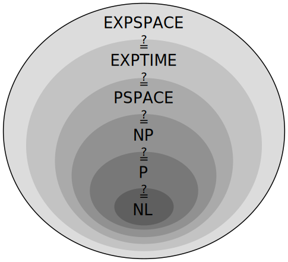

# P vs NP

The speed with which certain problems can be solved in terms of time and space
can be divided into two categories:

- polynomial
- non-polynomial: growth larger than any polynomial

The division is interesting because non-polyimial problems are *MUCH* harder to solve than polynomial ones.

Just consider the fact that on an exponential problem with $2^x$ complexit, increasing the problem size `x`
by one *doubles* the time it takes to solve the problem.

## P

Problem can be solved by a Turing machine in polynomial time.

## NP

Contains P

Problem solution can be verified, but not found, by a Turing machine in polynomial time.

For this reason, we want to believe that maybe they are easier to solve than other problems which we can't even check in polynomial time.

However, up to now, many NP problems can only be solved in exponential time, even if we can check them.

Example of NP problem: boolean satisfiability problem.

Non-example of NP problem: TSP. Even if we are given a solution, we cannot be sure that it is the optimum! This is often the case for optimization algorithms.

## NP-complete

Contained, but not equal to NP.

It can be proven that all NP problems can be reduced to certain NP problems (NP-complete) in polynomial time.

Not all NP problems however are NP-complete.

## Meaning of P vs NP

If a single NP-complete problem is proven to be in P, then all NP problems are also polynomial, and so P = NP.

This is what makes the P = NP question so interesting: if a single NP-complete problem is ever solved in P, every other NP problem can also be solved in P, and so P = NP

- if P = NP, every NP problem can be solved in polynomial time.

Since we have worked endless human hours searching for P algorithms to man NP-complete problems, it is widely believed that being NP-complete means that a problem cannot be solved in polynomial time.

- If P != NP, then we will be sure that all NP-complete really are hard, and that it is useless to search for P algorithms for them.

Important practical problems that are known to be NP-complete:

- knapsack problem (discrete linear programming)
- traveling salesman problem (discrete linear programming)

## NP-hard

Problems such that there is an NP-complete problem that reduces to it in Polynomial time.

That means that if an NP-hard problem can be solved in polynomial time, then an NP-complete problem can also be solved in polynomial time, and `P = NP`.

All NP-complete problems are also NP-hard, but some NP-hard problems are not NP-complete.

Implications of P = NP to NP-hard problems:

- if P != NP, then all NP-hard problems cannot be solved in Polynomial time.

- if P == NP, then the NP-hard problems which are also NP-complete can be solved in polynomial time, but we know nothing about the NP-hard problems which are not NP-complete.

### Decision vs optimization

It is very common to have optimization problems which are NP-hard, and for which the decision problem is NP-complete.

For example, in TSP, the decision problems are:

- is there a TSP path with cost at most 9?
- is there a TSP path with cost at most 10?
- ...

all of which are known to be NP-complete.

The optimization version of those problems is therefore immediately NP-hard, since if we knew that the optimum path has cost 5, we immediately know that there is at least one path with cost at most 9 or 10 (the path with cost 5), but no path with cost 4 (otherwise that would be the optimum).

## Other similar questions

Similar questions exist for many other related complexity classes. See:

### LSPACE

<http://en.wikipedia.org/wiki/L_%28complexity%29>

Logarithmic space.

### NL

<http://en.wikipedia.org/wiki/L_%28complexity%29>

Logarithmic space by non-deterministic Turing machine.
